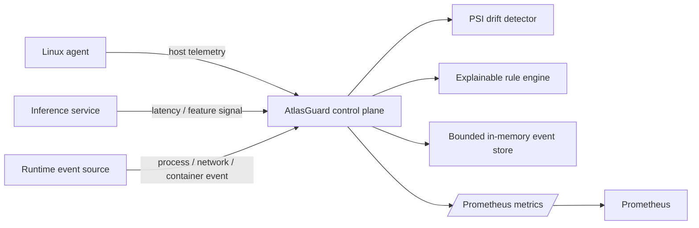

# AtlasGuard

[](https://github.com/lEoNardoToP/lEoNardoToP/actions/workflows/atlasguard-ci.yml)

**Linux-native observability, ML drift detection and explainable runtime security for distributed inference services.**

AtlasGuard is a compact control-plane prototype that treats model reliability and runtime
security as one operational problem. A lightweight Linux agent reports host telemetry,
applications report inference observations, and the control plane turns both streams into
Prometheus metrics, distribution-shift signals and deterministic security findings.

The goal is not to hide complexity behind a dashboard. The interesting parts are deliberately
inspectable: telemetry contracts, drift mathematics, rule evaluation, failure handling,
least-privilege deployment and tests.

## Why this exists

Production ML systems fail in more ways than "the model is inaccurate":

- input distributions drift while the service remains technically healthy;
- inference latency changes under resource pressure;
- unexpected shells or privileged workloads appear in the runtime;
- the monitoring plane itself can become noisy, fragile or over-privileged.

AtlasGuard puts these signals behind one small, reproducible API.

## Architecture



### Signal paths

**Host observability**
- CPU and memory utilization;
- one-minute load average;
- process count;
- established TCP connections;
- resilient agent loop when the controller is temporarily unavailable.

**ML observability**
- per-service/model inference latency histogram;
- optional confidence and input-size metadata;
- a numeric feature signal for distribution monitoring;
- Population Stability Index (PSI) with a reference baseline and rolling window.

**Runtime security**
- privileged runtime activity;
- root process execution;
- interactive/shell-like executables;
- unusual egress ports;
- mutable container tags.

Every runtime finding includes a stable rule name and an explanation. AtlasGuard does **not**
claim kernel/eBPF visibility yet; the runtime event schema is intentionally separated from
collection so an eBPF source can be added without changing the control-plane contract.

## Quick start

### Local Python

```bash
cd projects/atlasguard
python3 -m venv .venv
source .venv/bin/activate
pip install -e ".[dev]"

pytest -q
atlasguard serve
```

In another shell:

```bash
# Build the reference distribution.
atlasguard demo --count 120

# Shift the observed feature distribution.
atlasguard demo --shifted --count 120

curl http://127.0.0.1:8080/v1/state
curl http://127.0.0.1:8080/metrics
```

The second run eventually produces a PSI value above the configured drift threshold.

### Docker + Prometheus

```bash
docker compose up --build
```

- AtlasGuard API: http://127.0.0.1:8080
- OpenAPI: http://127.0.0.1:8080/docs
- Prometheus: http://127.0.0.1:9090

The application container runs as a non-root user, drops all Linux capabilities and uses a
read-only filesystem in Compose.

## API contract

`POST /v1/telemetry`

```json
{
  "agent_id": "ml-node-01",
  "host": {
    "hostname": "ml-node-01",
    "cpu_percent": 31.2,
    "memory_percent": 58.4,
    "load_1m": 1.7,
    "process_count": 218,
    "established_tcp": 23
  },
  "inference": [
    {
      "service": "recommendation-api",
      "model": "ranker-v3",
      "latency_ms": 42.0,
      "status_code": 200,
      "confidence": 0.91,
      "feature_value": 0.14,
      "input_bytes": 1810
    }
  ],
  "runtime": [
    {
      "kind": "process",
      "executable": "/bin/bash",
      "uid": 0,
      "privileged": true
    }
  ]
}
```

Example response:

```json
{
  "accepted": true,
  "findings": [
    {
      "severity": "high",
      "rule": "privileged-runtime",
      "message": "Privileged container/runtime activity observed."
    },
    {
      "severity": "medium",
      "rule": "root-process",
      "message": "Process executed as uid=0; verify this is expected."
    },
    {
      "severity": "high",
      "rule": "interactive-shell",
      "message": "Shell-like executable observed: /bin/bash"
    }
  ],
  "drift_score": null,
  "drifted": false
}
```

## Drift detection

AtlasGuard uses **Population Stability Index** because it is small, explainable and easy to
reproduce during an incident.

For reference bucket proportion `r_i` and current bucket proportion `c_i`:

```text
PSI = sum((c_i - r_i) * ln(c_i / r_i))
```

Quantile boundaries are learned from the reference window. The current implementation starts
with a 100-observation baseline and compares it with a rolling 100-observation window.

The detector is purposely isolated in `drift.py`: it can be replaced with KS tests,
embedding-distance monitoring or model-specific evaluation without changing ingestion.

## Operational design choices

- **Bounded memory:** the event store uses bounded deques.
- **Back-pressure awareness:** agents send compact batches rather than raw model inputs.
- **Privacy by design:** the telemetry contract stores metadata/features, not prompts or user text.
- **Low privilege:** the control-plane container runs non-root with no added capabilities.
- **Failure tolerance:** agent network failures do not terminate the collection loop.
- **Observable monitoring:** AtlasGuard exposes its own counters, histograms and drift gauges.
- **Explainability:** every security rule and drift computation is inspectable in source.

See [THREAT_MODEL.md](docs/THREAT_MODEL.md) for explicit trust boundaries and non-goals.

## Repository map

```text
atlasguard/
├── src/atlasguard/
│   ├── agent.py       # Linux host collector + resilient sender
│   ├── api.py         # FastAPI control plane + Prometheus metrics
│   ├── drift.py       # PSI implementation + rolling detector
│   ├── models.py      # typed telemetry contract
│   ├── rules.py       # explainable runtime policy engine
│   ├── store.py       # bounded thread-safe event store
│   └── cli.py         # serve / agent / demo commands
├── tests/
├── deploy/
│   ├── prometheus.yml
│   └── systemd/
├── docs/THREAT_MODEL.md
├── Dockerfile
├── docker-compose.yml
└── pyproject.toml
```

## Candidate portfolio

A recruiter-ready application package tailored to **Canonical**, **SurveyMonkey**, and **Sysdig** is available under [portfolio/](portfolio/).

It includes:

- a 16-slide PPTX presentation and PDF;
- three company-specific demo videos;
- Canonical, SurveyMonkey, and Sysdig technical briefs in DOCX and PDF;
- a complete ZIP bundle;
- the reproducible generator and GitHub Actions workflow used to build the binary assets.

Direct links:

- [Portfolio index](portfolio/README.md)
- [PowerPoint deck](portfolio/generated/AtlasGuard_Candidate_Portfolio_Canonical_SurveyMonkey_Sysdig.pptx)
- [Presentation PDF](portfolio/generated/AtlasGuard_Candidate_Portfolio_Canonical_SurveyMonkey_Sysdig.pdf)
- [Complete package ZIP](portfolio/generated/AtlasGuard_Candidate_Portfolio_Package.zip)
- [Canonical demo](portfolio/generated/videos/AtlasGuard_Canonical_Demo.mp4)
- [SurveyMonkey demo](portfolio/generated/videos/AtlasGuard_SurveyMonkey_Demo.mp4)
- [Sysdig demo](portfolio/generated/videos/AtlasGuard_Sysdig_Demo.mp4)

## Engineering roadmap

The next technically meaningful steps are:

1. mTLS agent identity and replay protection;
2. bounded-cardinality service/model registration;
3. eBPF runtime collector for process and network events;
4. durable event storage with retention policies;
5. Kubernetes DaemonSet + NetworkPolicy deployment;
6. per-feature drift registry and model-version baselines;
7. OpenTelemetry ingestion/export;
8. load testing and explicit SLOs.

Those items are intentionally listed as roadmap rather than presented as finished work.

## Author

**Leonardo Rosati** — Computer Science, University of Bologna  
[GitHub profile](https://github.com/lEoNardoToP) · [LinkedIn](https://www.linkedin.com/in/leonardo-rosati-97b863273/)
